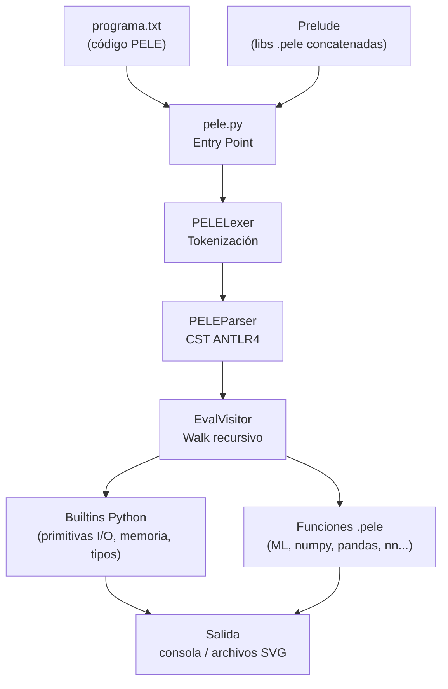
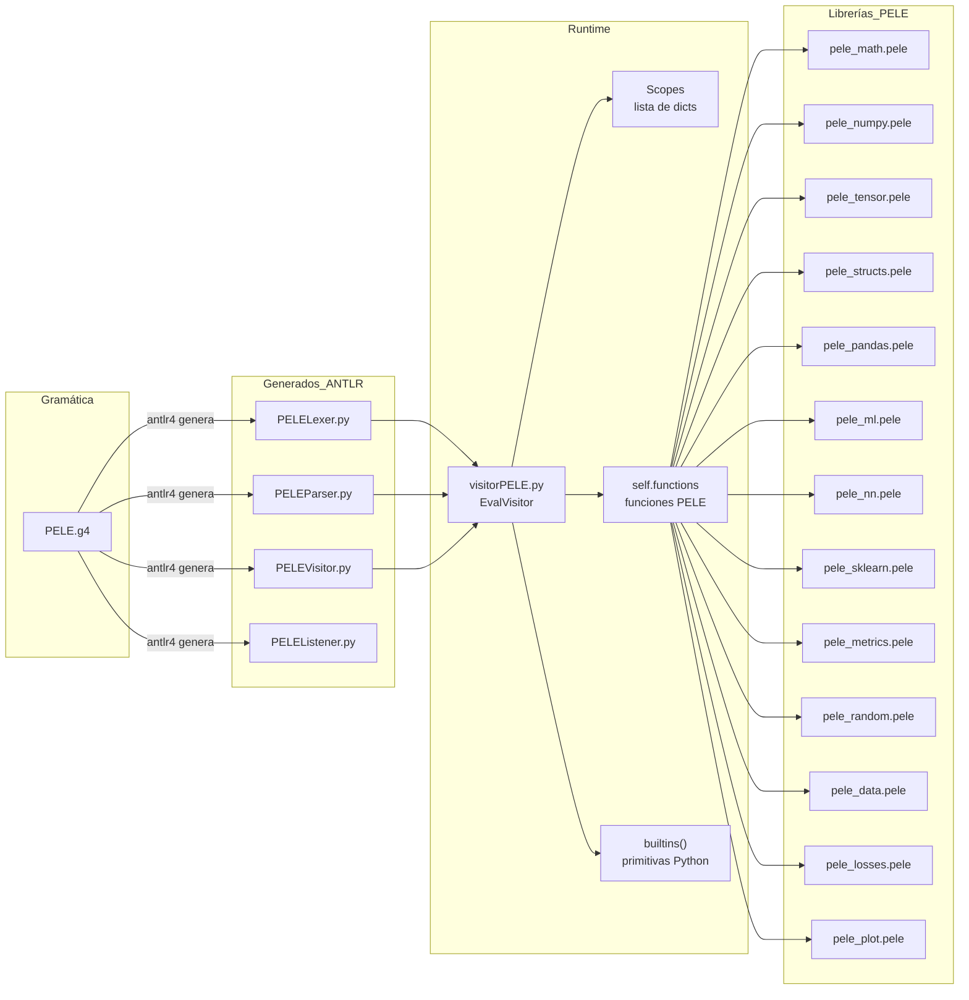
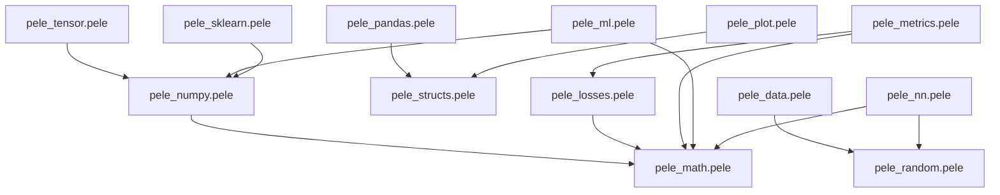

# PELE — Domain Specific Language para Machine Learning y Deep Learning

> DSL de paradigma funcional puro, implementado con ANTLR4 y Python,
> orientado al diseño, entrenamiento y evaluación de modelos ML/DL.

---

## 1. Introducción

### Descripción General

PELE es un lenguaje de programación de dominio específico (DSL) escrito
en español, diseñado para expresar pipelines completos de Machine Learning
y Deep Learning sin depender de librerías externas como NumPy, Pandas o
scikit-learn. El núcleo sintáctico se define en ANTLR4; la ejecución se
delega a un evaluador de árbol (Visitor) implementado en Python.

### Objetivo del DSL

Proveer una sintaxis declarativa y funcional que permita:

- Cargar y transformar datos tabulares (CSV).
- Entrenar modelos clásicos (regresión, KNN, K-Means, árbol de decisión).
- Entrenar redes neuronales densas con backpropagation.
- Evaluar modelos con métricas estándar.
- Exportar gráficos a SVG.

Todo lo anterior escrito en archivos `.pele`, sin importar librerías
Python desde el código del usuario.

### Problema que Resuelve

Los frameworks de ML existentes (TensorFlow, PyTorch, sklearn) exponen
APIs Python genéricas. PELE ofrece una sintaxis de alto nivel en español,
orientada específicamente a flujos de datos y modelos predictivos, con
semántica funcional que evita efectos secundarios no controlados.

### Motivación

Proyecto académico de construcción de compiladores e intérpretes.
Demuestra la implementación completa del pipeline:
`gramática → lexer → parser → AST → visitor → runtime`.

---

## 2. Características Principales

| Categoría | Funcionalidad | Estado |
|-----------|--------------|--------|
| Aritmética | `+ - * / % **` con precedencia correcta |  Completo |
| Aritmética vectorial | `[1,2] + [3,4]` element-wise |  Completo |
| Matrices | `np_matmul`, `np_transpose`, `np_reshape` |  Completo |
| Tensores | shape, ndim, flatten, concat, eye, clip |  Completo |
| Condicionales | `si / sino / sino si` anidado |  Completo |
| Ciclos | `por` (C-for), `mientras`, `for-in` |  Completo |
| Funciones | `funcion`, recursividad, lambdas `\x -> expr` |  Completo |
| Pipeline | operador `\|>` |  Completo |
| Archivos | `leer_archivo`, `escribir_archivo` |  Completo |
| CSV / Pandas | `pd_read_csv`, `pd_one_hot_encode`, `pd_select_columns` |  Completo |
| Graficación SVG | scatter, bar, learning curve, histogram |  Parcial |
| Regresión lineal | gradient descent batch |  Completo |
| Regresión logística | gradient descent + sigmoid |  Completo |
| Perceptrón | Rosenblatt clásico |  Completo |
| KNN | k vecinos + voto mayoritario |  Completo |
| K-Means | clustering no supervisado |  Completo |
| Árbol de decisión | Gini impurity, split binario |  Completo |
| MLP + Backprop | red neuronal densa multicapa |  Parcial |
| Métricas | accuracy, precision, recall, F1, R², RMSE, MAE |  Completo |
| Matriz de confusión | binaria (0/1) |  Parcial |
| Normalización | min-max, z-score |  Completo |
| Aleatoridad | LCG + Box-Muller, semilla controlada |  Completo |
| Estructuras | pilas, colas, conjuntos, árboles, grafos, BFS, DFS |  Completo |

---

## 3. Arquitectura General

### Flujo de Ejecución



### Componentes Principales



### Dependencias entre Librerías



---

## 4. Estructura del Repositorio

```text
pele/
├── PELE.g4                  # Gramática fuente ANTLR4
├── PELE.interp              # Metadatos ANTLR (generado)
├── PELE.tokens              # Tabla de tokens (generado)
├── PELELexer.py             # Lexer generado por ANTLR4
├── PELELexer.interp         # Metadatos lexer (generado)
├── PELELexer.tokens         # Tokens lexer (generado)
├── PELEParser.py            # Parser generado por ANTLR4
├── PELEListener.py          # Listener generado (no usado activamente)
├── PELEVisitor.py           # Visitor base generado por ANTLR4
├── visitorPELE.py           # EvalVisitor: intérprete principal
├── pele.py                  # Entry point del intérprete
├── programa.txt             # Suite de tests / programa usuario
├── grafico.svg              # SVG generado por np_plot (output)
├── .gitignore
│
├── pele_math.pele           # Funciones matemáticas y activaciones
├── pele_numpy.pele          # Abstracción de tensores (NumPy-like)
├── pele_tensor.pele         # Operaciones avanzadas de tensor
├── pele_structs.pele        # Estructuras de datos (pila, cola, grafo...)
├── pele_pandas.pele         # ETL y manipulación de DataFrames CSV
├── pele_random.pele         # Generador pseudoaleatorio (LCG)
├── pele_losses.pele         # Funciones de pérdida (MSE, BCE, CE)
├── pele_metrics.pele        # Métricas de evaluación ML
├── pele_data.pele           # Preprocesamiento (split, normalización)
├── pele_ml.pele             # Algoritmos ML clásicos
├── pele_sklearn.pele        # Perceptrón y wrappers sklearn-like
├── pele_nn.pele             # MLP con backpropagation
└── pele_plot.pele           # Generación de gráficos SVG
```

### Detalle por Archivo

#### `PELE.g4`
- **Propósito:** definición formal del lenguaje.
- **Responsabilidad:** léxico + sintaxis completa. Única fuente de verdad.
- **Dependencias:** ninguna en runtime; ANTLR4 tool para compilar.
- **Secciones:** tokens (literales y simbólicos), reglas sintácticas
  (`program`, `block`, `statement`, `expr`, `postfix`, `atom`,
  `ifStatement`, `functionDecl`, `params`, `assignment`, `dictEntry`).

#### `PELELexer.py` / `PELEParser.py` / `PELEVisitor.py` / `PELEListener.py`
- **Propósito:** código generado automáticamente por ANTLR4.
- **Responsabilidad:** tokenización, construcción del CST, interfaces
  Visitor y Listener.
- ** No editar manualmente.** Regenerar si se modifica `PELE.g4`.

#### `visitorPELE.py`
- **Propósito:** intérprete principal — núcleo semántico del proyecto.
- **Responsabilidad:** evaluar el CST producido por ANTLR4 y retornar
  valores Python.
- **Dependencias:** `PELEVisitor`, `PELEParser`, módulo `antlr4`.
- **Clases:**

| Clase | Descripción |
|-------|-------------|
| `ReturnValue(Exception)` | Mecanismo de early return via excepción |
| `PeleLambda` | Closure: guarda parámetro, contexto, referencia al visitor |
| `EvalVisitor(PELEVisitor)` | Visitor principal; implementa `visitXxx` por nodo |

- **Grupos de métodos en `EvalVisitor`:**

| Grupo | Métodos |
|-------|---------|
| Scope | `push_scope`, `pop_scope`, `set_var`, `get_var` |
| Aritmética | `visitAddSubExpr`, `visitMulDivModExpr`, `visitPowerExpr`, `visitUnaryMinusExpr` |
| Comparación | `visitRelationalExpr`, `visitEqExpr` |
| Lógica | `visitAndExpr`, `visitOrExpr`, `visitNotExpr` |
| Control flujo | `visitIfStatement`, `visitCicloWhile`, `visitCFor`, `visitForEach` |
| Funciones | `visitFunctionDeclStmt`, `visitReturnStmt`, `_call_user_func` |
| Literales | `visitIntExpr`, `visitFloatExpr`, `visitStringExpr`, `visitBoolExpr`, `visitArrayExpr`, `visitDictLiteralExpr` |
| Postfix | `visitIndexExpr`, `visitMethodCallExpr` |
| Pipe/Lambda | `visitPipeExpr`, `visitLambdaExpr`, `_apply_callable` |
| I/O | `visitMostrarStmt` |
| Builtins | `builtins()` — dict nombre→callable Python |

#### `pele.py`
- **Propósito:** entry point del intérprete.
- **Responsabilidad:** cargar librerías en orden, concatenar con el
  programa usuario, invocar el pipeline ANTLR4 → EvalVisitor.
- **Función principal:** `run_code(code: str)`.
- **Orden de carga de librerías** (crítico — dependencias implícitas):

```python
libs = [
    "pele_math.pele",      # 1. Base matemática
    "pele_numpy.pele",     # 2. Tensores (usa pele_math)
    "pele_structs.pele",   # 3. Estructuras de datos
    "pele_pandas.pele",    # 4. ETL (usa pele_structs)
    "pele_tensor.pele",    # 5. Ops avanzadas tensor
    "pele_random.pele",    # 6. RNG
    "pele_losses.pele",    # 7. Losses (usa pele_math)
    "pele_metrics.pele",   # 8. Métricas
    "pele_data.pele",      # 9. Preprocessing (usa pele_random)
    "pele_ml.pele",        # 10. Algoritmos ML
    "pele_nn.pele",        # 11. Redes neuronales
    "pele_sklearn.pele",   # 12. Perceptrón wrappers
    "pele_plot.pele",      # 13. Graficación SVG
]
```

#### `programa.txt`
- **Propósito:** suite de tests integrada y dashboard de validación.
- **Responsabilidad:** ejecuta y valida los 4 bloques funcionales del
  proyecto (core, estructuras, ML, pandas).
- **Patrón:** `assert(nombre, condicion)` propio basado en `runner_stats`.

#### `pele_math.pele`
- **Propósito:** matemática pura desde cero.
- **Funciones clave:**

| Función | Algoritmo |
|---------|-----------|
| `pele_sqrt(x)` | Newton-Raphson, 20 iteraciones |
| `pele_exp(x)` | Serie de Maclaurin, 30 términos |
| `pele_log(x)` | Reducción al intervalo + serie Leibniz, 100 términos |
| `pele_sigmoid(x)` | Numéricamente estable (rama positiva/negativa) |
| `pele_tanh(x)` | Vía `exp` |
| `pele_softmax(v)` | Estable: resta máximo antes de `exp` |
| `np_exp/log/sqrt/abs/sigmoid/relu/tanh` | Versiones tensor element-wise |

#### `pele_numpy.pele`
- **Propósito:** abstracción de tensores N-dimensionales.
- **Representación interna:**
{
"np": true,
"shape": [filas, columnas],
"ndim": 2,
"data": [v00, v01, v10, v11, ...]   // lista plana row-major
}
- **Funciones clave:** `np_array`, `np_zeros`, `np_ones`, `np_rand`,
  `np_uniform`, `np_add`, `np_sub`, `np_mul`, `np_div`, `np_matmul`,
  `np_sum`, `np_argmax`, `np_linspace`, `np_sin`, `np_cos`, `np_plot`.
- **Programación funcional:** `map(f, arr)`, `filter(f, arr)`,
  `reduce(f, arr, init)`.

#### `pele_tensor.pele`
- **Propósito:** operaciones adicionales sobre tensores.
- **Funciones:** `np_transpose`, `np_flatten`, `np_reshape`, `np_concat`,
  `np_eye`, `np_mean`, `np_max_val`, `np_min_val`, `np_clip`, `np_arange`.
- **Nota:** no implementa grafo computacional ni autograd.

#### `pele_structs.pele`
- **Propósito:** estructuras de datos funcionales.
- **Implementación:** todas sobre listas Python nativas.

| Estructura | Operaciones |
|------------|-------------|
| Pila | `pila_crear`, `pila_apilar`, `pila_desapilar`, `pila_tope`, `pila_vacia` |
| Cola | `cola_crear`, `cola_agregar`, `cola_remover`, `cola_frente`, `cola_vacia` |
| Conjunto | `conjunto_crear`, `conjunto_agregar`, `conjunto_tiene`, `conjunto_union`, `conjunto_interseccion` |
| Árbol | `arbol_crear`, `arbol_agregar_hijo`, `arbol_preorden`, `arbol_inorden` |
| Grafo | `grafo_crear`, `grafo_agregar_arista`, `grafo_bfs_nativo`, `grafo_dfs` |
| Matriz | `matriz_crear`, `matriz_get`, `matriz_set` |

#### `pele_pandas.pele`
- **Propósito:** ETL de datos tabulares desde strings CSV.
- **Representación DataFrame:**
{columnas: ["col1", "col2", ...], data: [[v00, v01], [v10, v11], ...]}
- **Funciones clave:** `pd_read_csv`, `pd_get_column`, `pd_select_columns`,
  `pd_drop_column`, `pd_fill_na`, `pd_head`, `pd_to_numpy`,
  `pd_one_hot_encode`, `pd_info`.
- **Limitaciones:** no soporta campos CSV con comas internas ni strings
  multi-línea.

#### `pele_random.pele`
- **Algoritmo:** LCG — `estado = (1664525 × estado + 1013904223) mod 2³²`.
- **Funciones:** `random_seed`, `random_float`, `random_uniform`,
  `random_randint`, `random_choice`, `random_sample`, `random_shuffle`,
  `random_gauss` (Box-Muller).

#### `pele_losses.pele`
- **Funciones:** `pele_mse`, `pele_mse_grad`, `pele_bce`, `pele_bce_grad`,
  `pele_cross_entropy`.

#### `pele_metrics.pele`
- **Funciones:** `precision`, `recall`, `f1_score`, `r2_score`, `rmse`,
  `mae`, `confusion_matrix` (solo binaria).

#### `pele_data.pele`
- **Funciones:** `train_test_split`, `normalizar` (min-max 1D/2D),
  `estandarizar` (z-score 2D), `mezclar_datos`.

#### `pele_ml.pele`
- **Algoritmos:**

| Algoritmo | Función entrenamiento | Función predicción |
|-----------|----------------------|-------------------|
| Regresión lineal | `linreg_fit(X, y, lr, epocas)` | `linreg_predict(modelo, X)` |
| Regresión logística | `logreg_fit(X, y, lr, epocas)` | `logreg_predict(modelo, X, umbral)` |
| KNN | `knn_fit(X, y, k)` | `knn_predict(modelo, punto)` |
| K-Means | `kmeans_fit(X, k, max_iter)` | `kmeans_predict(modelo, puntos)` |
| Árbol de decisión | `tree_fit(X, y, max_depth)` | `tree_predict(modelo, X)` |

#### `pele_sklearn.pele`
- **Propósito:** capa de alto nivel para el perceptrón.
- **Funciones:** `fit_perceptron`, `predecir_lote`, `prediccion`,
  `escalon`, `accuracy`, `mse`.

#### `pele_nn.pele`
- **Propósito:** red neuronal densa (MLP) con backpropagation manual.
- **Funciones:**

| Función | Descripción |
|---------|-------------|
| `nn_linear_init(n_in, n_out)` | Inicialización Xavier simplificada |
| `nn_linear_forward(capa, X)` | Forward pass batch |
| `nn_relu_forward/backward` | Activación ReLU con máscara |
| `nn_sigmoid_forward/backward` | Activación sigmoide |
| `nn_softmax(X)` | Softmax estable por fila |
| `nn_mlp_init(capas_dims)` | Crea red densa multicapa |
| `nn_mlp_forward(modelo, X)` | Forward pass completo |
| `nn_mlp_train(modelo, X, y, lr, epocas)` | Backprop + SGD |
| `nn_mlp_predict(modelo, X)` | Inferencia |

#### `pele_plot.pele`
- **Propósito:** generación de gráficos vectoriales SVG.
- **Funciones:** `plot_scatter`, `plot_bar`, `plot_learning_curve`,
  `plot_histogram`.
- ** Bug conocido:** escalado SVG produce coordenadas fuera del
  viewport cuando los datos tienen outliers extremos (ver `grafico.svg`).

---

## 5. Gramática del Lenguaje

### Palabras Reservadas

| Token | Literal | Uso |
|-------|---------|-----|
| `SI` | `si` | condicional |
| `SINO` | `sino` | rama else |
| `MIENTRAS` | `mientras` | bucle while |
| `POR` | `por` | bucle for C-style |
| `FOR` | `for` | bucle for-each |
| `IN` | `in` | iteración en for-each |
| `FUNCION` | `funcion` | declaración de función |
| `RETORNAR` | `retornar` | retorno de función |
| `NOT` | `no` | negación lógica |
| `TRUE` | `true` | booleano verdadero |
| `FALSE` | `false` | booleano falso |
| `MOSTRAR` | `mostrar` | print |

### Operadores

| Operador | Token | Precedencia | Asociatividad |
|----------|-------|-------------|---------------|
| `**` | POW | 8 | derecha |
| `* / %` | — | 7 | izquierda |
| `+ -` | — | 6 | izquierda |
| `< <= > >=` | LT LE GT GE | 5 | izquierda |
| `== !=` | EQEQ NEQ | 4 | izquierda |
| `&&` | AND | 3 | izquierda |
| `\|\|` | OR | 2 | izquierda |
| `\|>` | PIPE | 1 | izquierda |
| `-` (unario) | — | 10 | prefijo |
| `no` | NOT | 9 | prefijo |

### Reglas Sintácticas (ANTLR4 simplificado)

```antlr
program     : block EOF ;

block       : statement* ;

statement   : assignment ';'
            | expr ';'
            | 'mostrar' '(' expr ')' ';'
            | ifStatement
            | 'mientras' '(' expr ')' '{' block '}'
            | 'por' '(' assignment ';' expr ';' assignment ')' '{' block '}'
            | 'for' '(' ID 'in' expr ')' '{' block '}'
            | functionDecl
            | 'retornar' expr ';'
            ;

ifStatement : 'si' '(' expr ')' '{' block '}'
              ( 'sino' ifStatement | 'sino' '{' block '}' )? ;

functionDecl : 'funcion' ID '(' params? ')' '{' block '}' ;

params      : ID (',' ID)* ;

assignment  : ID '=' expr ;

expr        : postfix
            | '-' expr
            | 'no' expr
            | expr '**' expr
            | expr ('*' | '/' | '%') expr
            | expr ('+' | '-') expr
            | expr ('<' | '<=' | '>' | '>=') expr
            | expr ('==' | '!=') expr
            | expr '&&' expr
            | expr '||' expr
            | expr '|>' expr
            ;

postfix     : postfix '[' expr ']'
            | postfix '.' ID '(' (expr (',' expr)*)? ')'
            | atom
            ;

atom        : '(' expr ')'
            | ID '(' (expr (',' expr)*)? ')'
            | '[' (expr (',' expr)*)? ']'
            | '{' '}'
            | '{' dictEntry (',' dictEntry)* '}'
            | '\' ID '->' expr
            | 'true' | 'false'
            | STRING | INT | FLOAT | ID
            ;

dictEntry   : (STRING | ID) ':' expr ;
```

### Tipos de Tokens Literales

| Patrón | Token | Ejemplo |
|--------|-------|---------|
| `[0-9]+` | INT | `42` |
| `[0-9]+'.'[0-9]+` | FLOAT | `3.14` |
| `"..."` | STRING | `"hola"` |
| `[a-zA-Z_][a-zA-Z0-9_]*` | ID | `mi_var` |
| `// ...` | COMMENT (skip) | `// comentario` |
| espacios/tabs/newlines | WS (skip) | |

---

## 6. Funcionamiento Interno

### Lexer

`PELELexer` escanea el stream de caracteres y emite tokens. Reglas clave:

- Tokens multi-carácter (`|>`, `**`, `->`, `==`, `!=`, `<=`, `>=`)
  declarados **antes** de sus prefijos simples en `PELE.g4`.
- Strings: `'"' ( '\\' . | ~["\\] )* '"'` — soporta secuencias de escape.
- Comentarios y whitespace ignorados con `-> skip`.

### Parser

`PELEParser` implementa un parser LL(*) adaptativo generado por ANTLR4.
Construye un **Concrete Syntax Tree (CST)** — no un AST limpio.

La precedencia de operadores se define por el **orden de alternativas**
en la regla `expr`: las alternativas listadas primero tienen mayor
precedencia porque ANTLR las evalúa de arriba a abajo en el algoritmo
de predicción adaptativa.

Cada alternativa etiquetada (`# PowerExpr`, `# AddSubExpr`, etc.)
genera una subclase distinta de `ExprContext`, lo que permite al visitor
dispatch exacto por tipo de nodo.

### Visitor

`EvalVisitor` extiende la clase base `PELEVisitor` generada por ANTLR4.
Implementa un método `visitXxx` por cada tipo de nodo del CST.
ANTLR llama visitor.visit(nodo)
→ despacha a visitXxx según tipo de nodo
→ visitXxx evalúa recursivamente hijos con self.visit(hijo)
→ retorna valor Python (int, float, str, list, dict, PeleLambda)
**Mecanismo de retorno:**
`ReturnValue(Exception)` se lanza en `visitReturnStmt` y se captura en
`_call_user_func`. Esto evita continuar la ejecución del bloque después
del `retornar`.

**Lambdas:**
`PeleLambda` guarda el contexto de evaluación. Al aplicarse vía `|>` o
llamada directa, el visitor hace push de scope, enlaza el parámetro, y
evalúa el cuerpo.

### Runtime

#### Variables y Scopes

```python
self.scopes = [{}]   # lista de dicts; índice 0 = global

# Al entrar a función:
self.push_scope()    # añade {} al final
# Al salir:
self.pop_scope()     # elimina el último

# Lookup de variable:
for s in reversed(self.scopes):
    if name in s: return s[name]
# → lexical scoping: locales ocultan globales
```

#### Tipos Soportados

| Tipo PELE | Tipo Python | Notas |
|-----------|-------------|-------|
| entero | `int` | |
| decimal | `float` | |
| texto | `str` | |
| arreglo | `list` | mutable |
| mapa | `dict` | llaves string |
| booleano | `bool` | |
| lambda | `PeleLambda` | closure |
| tensor | `dict` con `__np__: True` | representación numpy-like |
| DataFrame | `dict` con `columnas` y `data` | representación pandas-like |

#### Funciones

Las funciones PELE se almacenan en `self.functions` (separado de scopes):

```python
self.functions["nombre"] = {
    "params": ["a", "b"],
    "block": <BlockContext ANTLR>
}
```

Esto significa que las funciones son **globales** — no hay funciones
como valores de primera clase almacenables en variables (excepto
lambdas). Pueden pasarse por nombre como string a `map("fn", arr)`.

#### Builtins

Solo exponen operaciones imposibles de implementar en PELE puro:

```python
{
    "arr_get": lambda arr, idx: arr[int(idx)],
    "arr_set": self._arr_set,
    "longitud": lambda x: len(x),
    "entero": lambda x: int(x),
    "decimal": lambda x: float(x),
    "a_texto": lambda x: str(x),
    "crear_pila": lambda: [],
    "pila_push": self._pila_push,
    "crear_mapa": self._crear_mapa,
    "mapa_get": self._mapa_get,
    "mapa_put": self._mapa_put,
    "escribir_archivo": self._escribir_archivo,
    "leer_archivo": self._leer_archivo,
    "error": self._error,
    # ...
}
```

---

## 7. Ejemplos de Uso

### Operaciones Matemáticas

```pele
// Aritmética básica
a = 2 ** 10;
mostrar(a);         // > 1024

// Aritmética vectorial element-wise
v1 = [1, 2, 3];
v2 = [4, 5, 6];
mostrar(v1 + v2);   // > [5, 7, 9]
mostrar(2 * v1);    // > [2, 4, 6]

// Funciones matemáticas
mostrar(pele_sqrt(16.0));    // > 4.0
mostrar(pele_sigmoid(0.0));  // > 0.5
```

### Matrices y Tensores

```pele
// Crear tensor 2D
A = np_array([[1, 2], [3, 4]]);
B = np_array([[5, 6], [7, 8]]);

// Multiplicación matricial
C = np_matmul(A, B);
mostrar(np_shape(C));    // > [2, 2]

// Transponer
At = np_transpose(A);

// Tensor de ceros
Z = np_zeros([3, 3]);
```

### Condicionales

```pele
x = -5;

si (x > 0) {
    mostrar("positivo");
} sino si (x == 0) {
    mostrar("cero");
} sino {
    mostrar("negativo");
}
// > negativo
```

### Ciclos

```pele
// C-style for
suma = 0;
por (i = 1; i <= 10; i = i + 1) {
    suma = suma + i;
}
mostrar(suma);    // > 55

// For-each
for (c in "PELE") {
    mostrar(c);
}
// > P  E  L  E

// While
n = 1;
mientras (n < 100) {
    n = n * 2;
}
mostrar(n);    // > 128
```

### Funciones y Lambdas

```pele
// Función recursiva
funcion factorial(n) {
    si (n <= 1) { retornar 1; }
    retornar n * factorial(n - 1);
}
mostrar(factorial(6));    // > 720

// Lambda y pipeline
cuadrado = \x -> x * x;
resultado = 5 |> cuadrado;
mostrar(resultado);    // > 25

// Map funcional
dobles = map(\x -> x * 2, [1, 2, 3, 4]);
mostrar(dobles);    // > [2, 4, 6, 8]
```

### Carga y Procesamiento de Datos

```pele
csv = "edad,salario,clase\n25,40000,0\n35,60000,1\n45,80000,1\n";
df = pd_read_csv(csv);

// Información del DataFrame
pd_info(df);

// Seleccionar columnas
X_df = pd_select_columns(df, ["edad", "salario"]);
y    = pd_get_column(df, "clase");

// One-Hot Encoding
df2 = pd_one_hot_encode(df, "clase");
mostrar(df2["columnas"]);
```

### Regresión Lineal

```pele
X = [[1.0, 1.0], [2.0, 1.0], [3.0, 2.0], [4.0, 3.0]];
y = [1.0, 2.0, 3.0, 4.0];

modelo = linreg_fit(X, y, 0.005, 500);
preds  = linreg_predict(modelo, X);

mostrar(r2_score(y, preds));    // > ~0.98
```

### Clasificación con KNN

```pele
X_train = [[1.0, 1.0], [1.5, 1.5], [8.0, 8.0], [8.5, 8.5]];
y_train = [0, 0, 1, 1];

knn = knn_fit(X_train, y_train, 3);

mostrar(knn_predict(knn, [1.2, 1.3]));    // > 0
mostrar(knn_predict(knn, [8.3, 8.2]));    // > 1
```

### Red Neuronal (MLP)

```pele
// Arquitectura: 2 entradas → 4 neuronas ocultas → 1 salida
random_seed(42);
mlp = nn_mlp_init([2, 4, 1]);

// Datos XOR
X = [[0.0, 0.0], [0.0, 1.0], [1.0, 0.0], [1.0, 1.0]];
y = [[0.0], [1.0], [1.0], [0.0]];

historia = nn_mlp_train(mlp, X, y, 0.1, 1000);
preds    = nn_mlp_predict(mlp, X);
mostrar(preds);

// Exportar curva de aprendizaje
plot_learning_curve(historia, "curva.svg");
```

### Métricas de Evaluación

```pele
y_real = [1, 0, 1, 1, 0, 1, 0, 0];
y_pred = [1, 0, 1, 0, 0, 1, 1, 0];

mostrar(precision(y_real, y_pred, 1));        // > 0.75
mostrar(recall(y_real, y_pred, 1));           // > 0.75
mostrar(f1_score(y_real, y_pred, 1));         // > 0.75
mostrar(confusion_matrix(y_real, y_pred));    // > [[3, 1], [1, 3]]
```

---

## 8. Instalación

### Requisitos del Sistema

| Componente | Versión mínima |
|------------|---------------|
| Python | 3.8+ |
| Java JRE/JDK | 11+ (solo para recompilar gramática) |
| ANTLR4 tool | 4.13.x (solo para recompilar gramática) |

### Instalación de Dependencias Python

```bash
# Crear y activar entorno virtual
python3 -m venv env
source env/bin/activate          # Linux/macOS
# env\Scripts\activate           # Windows

# Instalar runtime ANTLR4
pip install antlr4-python3-runtime==4.13.2
```

> **Nota:** no se requiere ninguna otra dependencia Python en runtime
> (sin NumPy, Pandas, TensorFlow, etc.).

---

## 9. Ejecución

### Ejecutar el Intérprete

```bash
# Desde la raíz del proyecto
python3 pele.py
```

Esto ejecuta `programa.txt` como programa principal, con todas las
librerías `.pele` precargadas como prelude.

### Ejecutar un Programa Propio

```bash
# Reemplazar programa.txt con el archivo deseado, o modificar pele.py:
# Cambiar: open("programa.txt") → open("mi_programa.pele")
python3 pele.py
```

### Recompilar la Gramática (Opcional)

Solo necesario si se modifica `PELE.g4`:

```bash
# Instalar ANTLR4 tool (una vez)
pip install antlr4-tools

# Recompilar
antlr4 -Dlanguage=Python3 -visitor PELE.g4

# Archivos generados/actualizados:
# PELELexer.py, PELEParser.py, PELEVisitor.py, PELEListener.py
# PELE.interp, PELE.tokens, PELELexer.interp, PELELexer.tokens
```

### Salida Esperada al Ejecutar `programa.txt`

=================================================================
PELE SUITE RUNNER DASHBOARD
[BLOQUE 1] SINTAXIS Y OPERADORES CORE
[PASS] Operadores logicos (&&, ||, no)
[PASS] Acceso por indice [] en listas
...
[BLOQUE 4] DATA WRANGLING CON PANDAS NATIVO
[PASS] Pandas (pd_read_csv y casteo automatico)
[PASS] Pandas (pd_one_hot_encode en variables categoricas)
=================================================================
DASHBOARD SUMMARY
Pruebas Ejecutadas: 18
Pruebas Exitosas:   18
Pruebas Fallidas:   0
¡FELICITACIONES! PELE HA SUPERADO EL 100% DE LAS PRUEBAS
---

## 10. Dependencias

| Dependencia | Versión | Propósito | Obligatoria |
|-------------|---------|-----------|-------------|
| `antlr4-python3-runtime` | 4.13.2 | Runtime del parser/lexer generado |  Sí |
| `Java JRE/JDK` | 11+ | Compilar `PELE.g4` con la tool ANTLR |  Solo desarrollo |
| `antlr4-tools` (pip) | cualquiera | Alternativa pip para la tool ANTLR |  Solo desarrollo |
| Python stdlib (`sys`, `open`) | 3.8+ | I/O y configuración de recursión |  Sí (incluida) |

---

## 11. Relación con los Requerimientos del Proyecto

| Requerimiento | Archivo(s) Responsable(s) | Estado |
|---------------|--------------------------|--------|
| Operaciones aritméticas completas | `PELE.g4`, `visitorPELE.py` |  Completo |
| Operaciones matriciales | `pele_numpy.pele`, `pele_tensor.pele` |  Completo |
| Condicionales y ciclos | `PELE.g4`, `visitorPELE.py` |  Completo |
| Graficación de datos | `pele_plot.pele`, `np_plot` en `pele_numpy.pele` |  Parcial |
| Lectura y escritura de archivos | `visitorPELE.py` (builtins) |  Completo |
| Regresión lineal | `pele_ml.pele` |  Completo |
| Regresión logística | `pele_ml.pele` |  Completo |
| Perceptrón multicapa (MLP) | `pele_nn.pele` |  Parcial |
| Algoritmos de agrupamiento | `pele_ml.pele` (K-Means) |  Completo |
| Algoritmos de clasificación | `pele_ml.pele` (KNN, árbol), `pele_sklearn.pele` (perceptrón) |  Completo |
| Predicción con redes neuronales | `pele_nn.pele` |  Parcial |
| Ejecución desde consola | `pele.py` |  Completo |
| Implementación con Visitor + ANTLR | `visitorPELE.py`, `PELE.g4` |  Completo |

**Leyenda:**
-  Completo: implementado y funcional.
-  Parcial: implementado con limitaciones conocidas.
-  No implementado: ausente.

---

## 12. Limitaciones Actuales

### Rendimiento

- Todos los algoritmos ML corren en Python puro sin NumPy.
- `np_matmul` 2D×2D: O(n³) sin optimización.
- Sort en KNN: O(n²) burbuja.
- El MLP no es viable para datasets con más de ~500 muestras.

### Manejo de Errores

- `visitBlock` captura excepciones e imprime el mensaje pero **continúa
  la ejecución** por defecto. Un error en la línea 10 no detiene el
  programa.
- No hay verificación de tipos en tiempo de análisis — los errores de
  tipo se manifiestan como excepciones Python con mensajes no siempre
  claros para el usuario.
- El parser ANTLR hace recovery automático — código sintácticamente
  inválido puede "ejecutar" parcialmente.

### Escalabilidad

- Todas las funciones PELE viven en un namespace global plano
  (`self.functions`). No hay sistema de módulos o namespaces.
- El prelude concatena ~2500 líneas de `.pele` antes de cada ejecución.
- El orden de carga de librerías en `pele.py` es una dependencia
  implícita no documentada formalmente — cambiar el orden rompe el
  intérprete.

### Funcionalidades Faltantes

| Funcionalidad | Impacto |
|--------------|---------|
| Optimizadores modernos (Adam, RMSProp) | MLP converge lento |
| Regularización (L1/L2, Dropout) | Modelos propensos a overfitting |
| Confusion matrix multiclase | Solo binaria implementada |
| Sistema de módulos / imports | Todo en namespace global |
| Tipos estáticos o inferencia | Sin type checking |
| Grafo computacional / autograd | Backprop manual, frágil |
| Soporte GPU | No aplica (Python puro) |
| REPL interactivo | No existe |

### Bugs Conocidos

| Bug | Archivo | Descripción |
|-----|---------|-------------|
| Coordenadas SVG fuera de viewport | `pele_numpy.pele` (`np_plot`) | El escalado falla con outliers extremos |
| Cache índice fijo en backprop | `pele_nn.pele` (`nn_mlp_train`) | `mask_idx = l * 2 + 1` asume estructura fija |
| `tail(cola)` O(n) en BFS | `pele_structs.pele` | BFS sobre grafos grandes es O(n²) |
| `pele_log(0)` diverge | `pele_math.pele` | Sin guard para x ≤ 0 |

---

## 13. Posibles Mejoras Futuras

### Arquitectura

- **AST propio:** construir un AST limpio antes del visitor, desacoplando
  la semántica de la gramática ANTLR. Permite transformaciones, linting
  y optimizaciones sin tocar la gramática.

- **Sistema de módulos:**
```pele
  importar "pele_numpy";   // carga funciones en namespace np
```

- **Type checker en dos pasadas:** primera pasada infiere tipos, segunda
  evalúa. Permite detectar `np_matmul(escalar, lista)` antes de ejecutar.

### Performance

- **Builtins NumPy opcionales:** activar con flag para operaciones
  matriciales 10-100× más rápidas.

```python
  # En visitorPELE.py
  "np_matmul": lambda a, b: np.dot(
      a["data"], b["data"]
  ).tolist()   # opt-in
```

- **Cola con deque:** sustituir `tail(cola)` por `collections.deque`
  en la implementación de colas — O(1) en ambos extremos.

### Calidad

- **Mensajes de error semánticos:**
[Error línea 42] np_matmul: dimensiones incompatibles [3] × [2, 4]
- **Suite de tests automatizada:**
```bash
  python3 runner.py tests/          # ejecuta todos los .pele en tests/
```

- **Detener ejecución en primer error** por defecto (cambiar
  `stop_on_error` default a `True`).

### Funcionalidades ML

- Optimizador Adam.
- Regularización L2 en regresión y MLP.
- Confusion matrix N×N para multiclase.
- Cross-validation k-fold.
- Inicialización K-Means++ para mejor convergencia.

### Herramientas

- REPL: `python3 pele.py --repl`
- Formateador de código `.pele`
- Language Server Protocol (LSP) básico para soporte IDE

---

## 14. Conclusión

PELE implementa correctamente el pipeline completo de un intérprete
basado en gramática formal:
Gramática ANTLR4 → Lexer → Parser → CST → Visitor → Runtime Python
La arquitectura de librerías funcionales puras en `.pele` — sin lógica
ML en el runtime Python — es la decisión de diseño más destacada del
proyecto: garantiza que el DSL sea autocontenido y que su semántica sea
verificable leyendo únicamente los archivos `.pele`.

Los algoritmos ML implementados son correctos conceptualmente y
demuestran dominio de los fundamentos: gradient descent, backpropagation,
distancias euclidianas, Gini impurity. La suite de 18 tests que pasa
al 100% valida la integración end-to-end del sistema.

Las limitaciones principales — rendimiento en Python puro, manejo de
errores permisivo, ausencia de sistema de tipos — son inherentes al
alcance académico del proyecto y no comprometen su validez como
demostración de los conceptos de compiladores e intérpretes.

| Dimensión | Valoración |
|-----------|-----------|
| Corrección gramatical | Alta |
| Completitud semántica | Alta |
| Cobertura de algoritmos ML | Media-Alta |
| Robustez ante errores | Media-Baja |
| Rendimiento en datos reales | Baja |
| Extensibilidad | Media |
| Calidad de código | Media-Alta |
| Madurez general | Prototipo avanzado |
